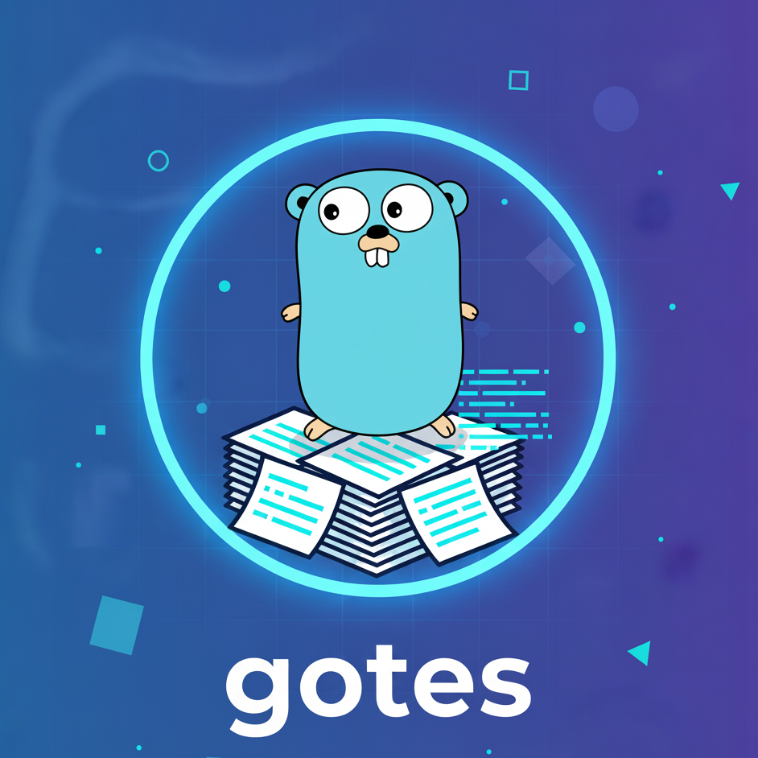

<p align="left">
  
</p>

# gotes — A Simple Terminal Task Manager in Go

**gotes** is a lightweight, terminal-based task manager built with **Go**, powered by **Cobra** for command-line structure and **Bubble Tea** for an interactive TUI (Text User Interface).  
Tasks are stored locally in a simple **JSON file**, so everything stays fast, minimal, and dependency-free.

---

##  Features

- 📝 Add, delete, toggle and print tasks from the command line  
- 💾 All tasks are persisted in a JSON file (`test.json` by default)  
- 🖥️ Interactive **TUI mode** with keyboard navigation:
  - `↑` / `↓` — move between tasks  
  - `Enter` — toggle task completion    
  - `q` — quit the interface  
- ⚙️ Built with:
  - [`spf13/cobra`](https://github.com/spf13/cobra) — command-line framework  
  - [`charmbracelet/bubbletea`](https://github.com/charmbracelet/bubbletea) — terminal UI  
  - [`charmbracelet/lipgloss`](https://github.com/charmbracelet/lipgloss) — styling  

---

##  Installation

```bash
git clone https://github.com/<your-username>/gotes.git
cd gotes

# build binary
go build -o gotes
go install

# show available commands
gotes --help
```

## Project structure
```bash
gotes/
├── cmd/
│   ├── add.go          
│   ├── delete.go   
│   ├── print.go        
│   ├── toggle.go      
│   ├── tui.go        
│   └── root.go        
│
├── internal/
│   ├── filemanager.go  
│   └── task.go       
│
├── main.go            
├── test.json           
├── go.mod
├── go.sum
└── LICENSE


```

Created by Rafal Kotarski (kotjuz)
MIT License © 2025
